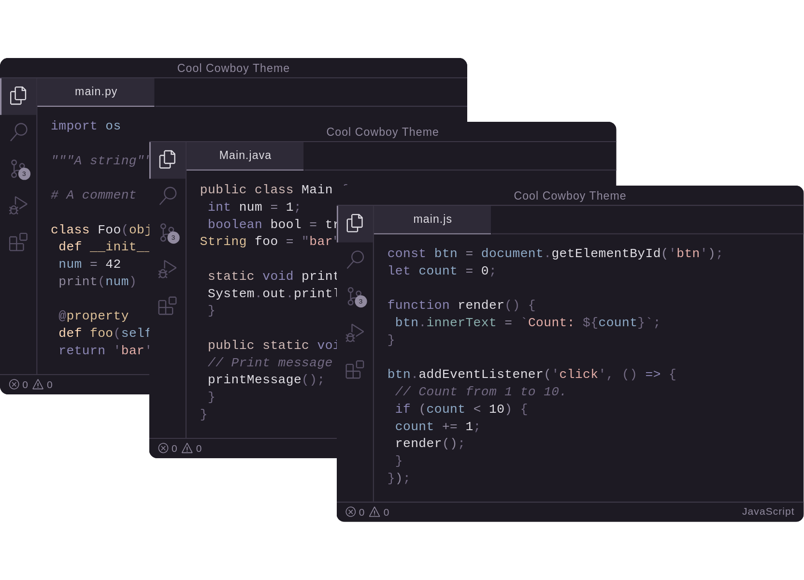
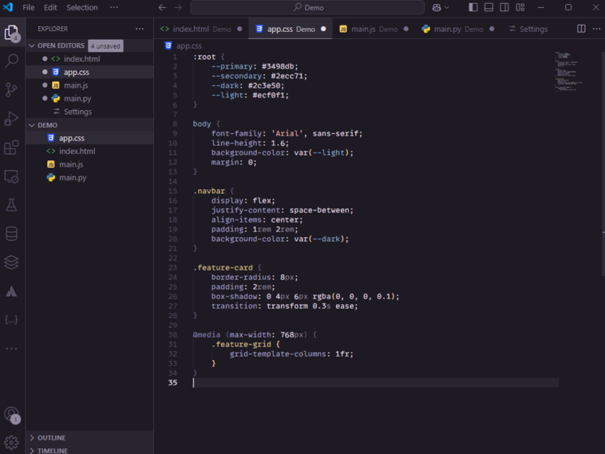

# Cool Cowboy Theme 🤠

A dark theme blending muted cool and warm colors, creating a balanced and comfortable coding environment inspired by Western aesthetics. Intentionally designed without red or green colors to reduce visual distractions and provide a more focused coding experience.

## Preview

## Features

- Balanced dark theme with carefully selected colors
- Easy on the eyes for long coding sessions
- Muted cool and warm tones inspired by Western landscapes
- Purposefully avoids red and green colors to minimize distractions and ease eye strain for developers with color vision deficiencies
- Great contrast for improved readability
- Support for popular programming languages including HTML, CSS, JavaScript, Python, and more

### HTML

_Clean syntax highlighting for HTML elements and attributes_

### CSS

_Beautiful styling for your stylesheets including CSS variables and media queries_

### JavaScript

_Modern JavaScript with class syntax, async/await, and ES6+ features_

### Python

_Clear distinction between functions, variables, and built-in Python keywords_

## Color Philosophy

This theme intentionally avoids red and green colors, which can be distracting during long coding sessions. Instead, it uses a carefully curated palette of blues and warm neutrals to create a comfortable, distraction-free coding environment while maintaining excellent readability.

## Installation

1. Open Visual Studio Code
2. Go to Extensions (Ctrl+Shift+X / Cmd+Shift+X)
3. Search for "Cool Cowboy Theme"
4. Click Install
5. Press Ctrl+K Ctrl+T (or Cmd+K Cmd+T on macOS) to open the theme selector
6. Select "Cool Cowboy Theme"

## License

[MIT License](LICENSE.md)
